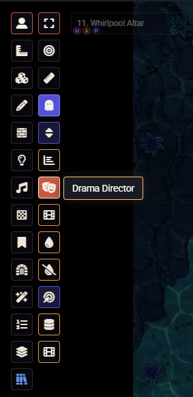

# 🎭 Drama Director

🇬🇧 English | [🇷🇺 Русский](#-russian)

---

## 🇬🇧 English

**Compatibility:** Foundry VTT v12–v13  

**Drama Director** brings cinematic storytelling tools to Foundry VTT.  
Turn your sessions into immersive movies with epic intros, dramatic character reveals, visual novel sequences, cutscenes, and atmospheric effects.

---

### 🎬 Features

| Category | Description |
|----------|------------|
| 🎭 **Cinematic Intros** | Multiple stylish intro sequences |
| 🏁 **Endings** | Session-ending cinematic sequences |
| ✨ **Map Effects** | Vignette, Black & White, Sepia, Film Grain, Glitch, Blood overlay, Sakura petals |
| 📺 **Video Player** | Play video overlays on scenes for all players simultaneously |
| 📖 **Visual Novel Mode** | Full VN system with portraits, dialogues, and voice recognition |

---

### 🎮 Getting Started

1. Install the module using the manifest link below.
2. Activate it in your world.
3. Click the 🎭 **Theater Masks** icon in the Token Controls panel.
4. The main **Drama Director** panel will open.

All effects are automatically synchronized with players via sockets.

---

### 📦 Installation

Manifest URL: https://raw.githubusercontent.com/phoenix1cold/drama-director-fvtt/main/module.json

---

---

---

## 🇷🇺 Russian

# Drama Director

**Совместимость:** Foundry VTT v12–v13

**Кинематографические эффекты для Foundry VTT** — превращайте ваши сессии в настоящие фильмы с эпичными вступлениями, визуальными новеллами, кат-сценами и атмосферными эффектами.

---

## 🎬 Возможности

| Категория | Описание |
|-----------|----------|
| **🎭 Кинематографические вступления** | Различные интро |
| **🏁 Эндинги** | Различные завершения сессий |
| **✨ Эффекты карты** | Виньетка, Ч/Б, сепия, плёнка, глитч, кровь, сакура |
| **📺 Видеоплеер** | Воспроизведение видео поверх сцены для всех игроков |
| **⚡ Cut-Ins** | 21 тема кат-сцен с текстом и изображениями |
| **📖 Visual Novel** | Полноценный VN-режим с портретами, диалогами и голосовым распознаванием |

## 🎮 Начало работы

После активации модуля нажмите на иконку 🎭 **(театральные маски)** в панели токенов — откроется главная панель Drama Director.

Все эффекты транслируются игрокам автоматически через сокеты.

Ссылка на установку:
https://raw.githubusercontent.com/phoenix1cold/drama-director-fvtt/main/module.json

